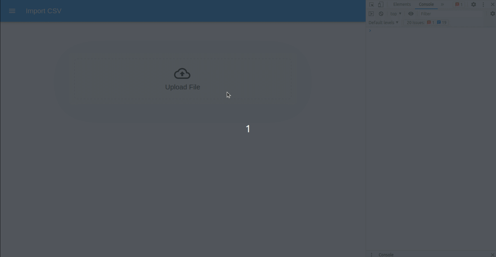

# CSV File Header Mapping

### [Test Here](https://release.do0cl2s7zyi22.amplifyapp.com/)

## About
This app parses CSV files and created data as JavaScript objects by letting users map column headers to existing object properties.

## How to use
You can check out various CSV files in the **dummy-data** folder. You can create your own csv files or you can upload them to test the app.

## Demo

## How this Works
The app is built in React a JavaScript Library and uses the following dependencies -
- xlsx for parsing
- Material UI
- Webpack for bundling

Steps - 
1. When the user uploads a file, the file is parsed and all the columns are extracted.
2. Pre-existing mappings are created for the common columns to existing object properties.
3. A Pop-up is displayed with drop-downs to let users map un-common columns.
4. Once the values are selected from the dropdown, the user will click the Import button.
5. The mapping is used to convert the data into object and upload to a API.

## Dev Environment

- Use node version 18.1.0.
- Open the folder in your code editor.
- Open your terminal and install node_modules  `npm install`
- Once done, to run the project on your browser use command `npm run start`.